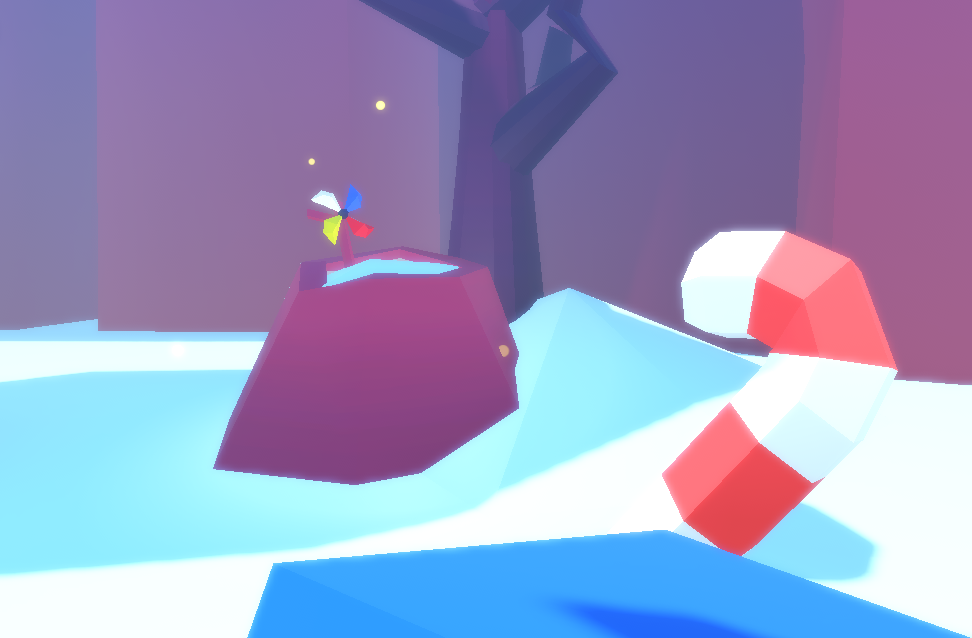
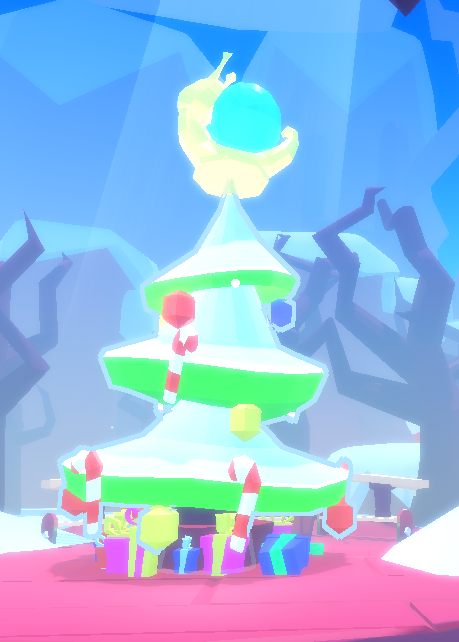
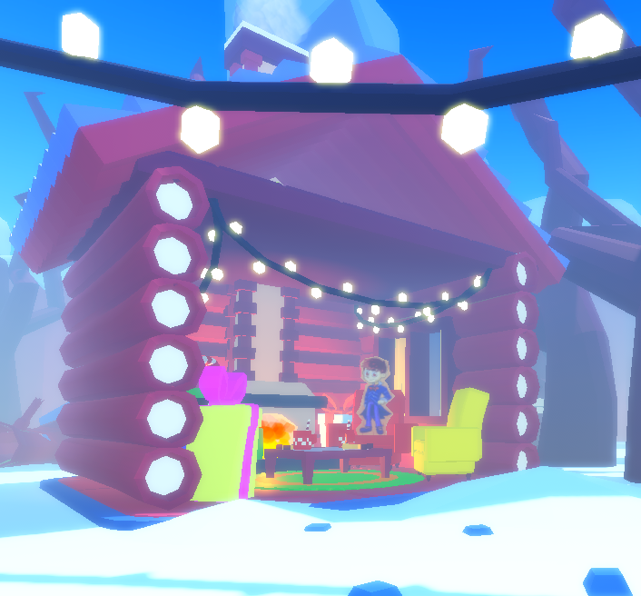
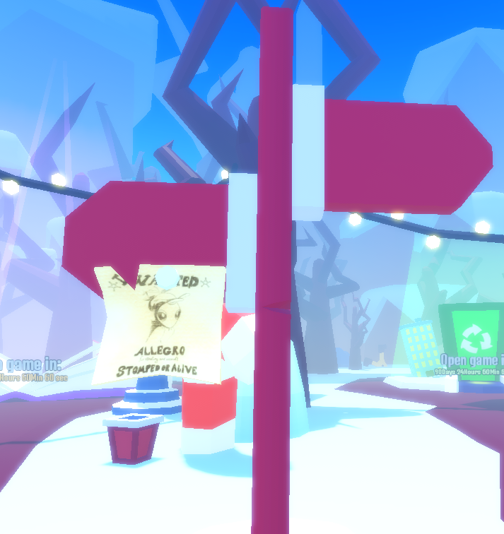
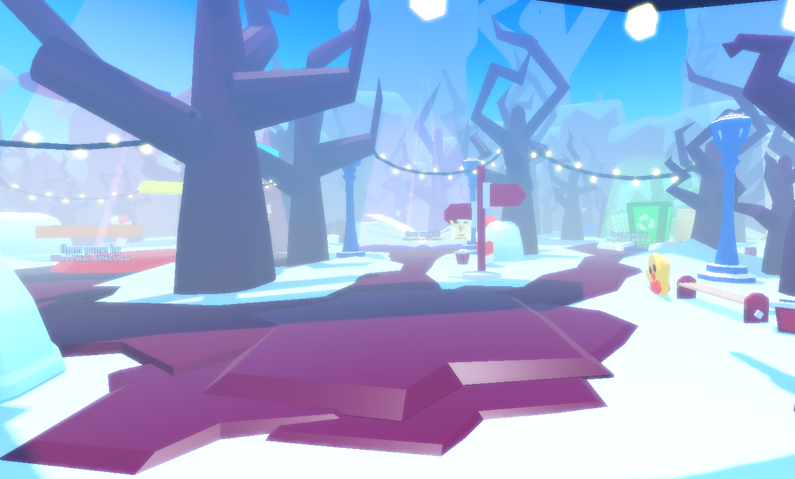
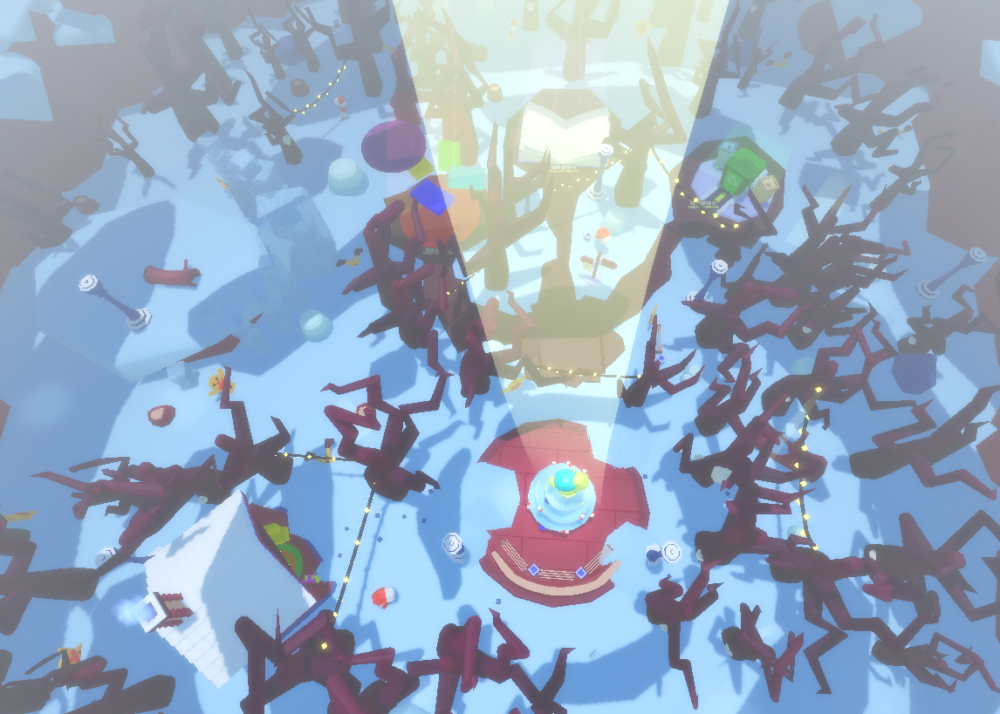

# EVINL HUB - ???
 **Evink hub - is a project for two or more games from the same studio. The bottom line is that the player enters one place and enters other games that he wants to play.**

# Description of the game
**The idea is to combine several games. Also, to develop this is to connect one save date and also make a common currency, which in games from this studio can be exchanged for something expensive. We also had an idea to continue the development of this project.**

# Links to important sources
*EVINK HUB* - [Roblox game](https://www.roblox.com/games/15979397263/Evink-hub-PART-2)

*EVINK COMMUNITY* - [Roblox group](https://www.roblox.com/groups/33683629/EVINK-COMMUNITY#!/about)

# Content from the game:

 

**VIDEO GAME|** - [YouTube](https://www.youtube.com/watch?v=PWGuNNW0bbg)

## Project Developers

*Vladislov* - [Telegram](https://t.me/vvlad_islovv), [Roblox](https://www.roblox.com/users/707163568/profile). [YouTube](https://www.youtube.com/@EvkaIT), [Discrod](https://discordapp.com/users/913864273279746139/)

*BedyWorld* - [Telegram](https://t.me/BedyWorld), [Discrod](https://discordapp.com/users/780117603183624203/)
